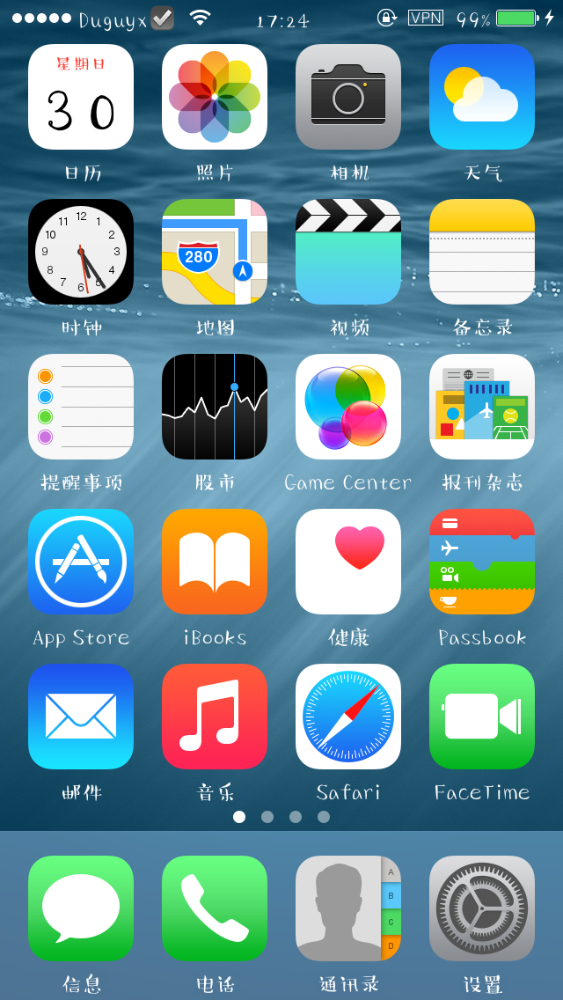
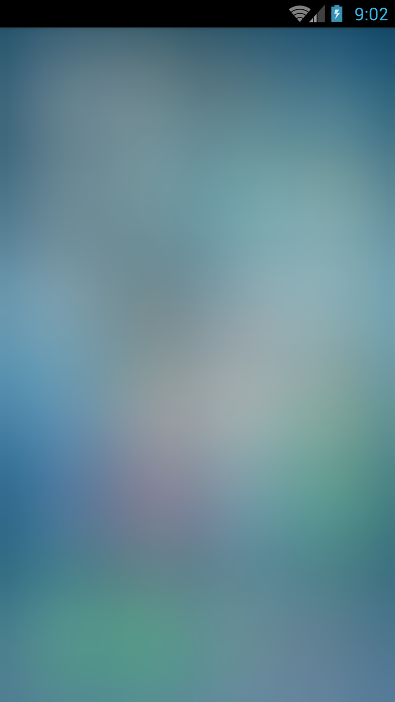

# anroid-image-blur
一个android 下的对图片进行模糊的辅助类库

# 名词解释： 
虚化，模糊化，或者 毛玻璃效果 。即把一种图片变得模糊，变虚，类似在拍照时看到的虚。
在ios系统中，主系统的启动后的背景就是一个虚化的效果。
给人一种浸入的感觉，背景和内容是有关联的。

# 介绍
把一个图片 进行虚化生成新的图片。

原图：

模糊后：

# 引用类库的方法：

   1. 下载 androidimageblur 源代码库，
   2. 在你的项目中引用该类库
   
   
# 代码
    
    //缩放并显示
    Bitmap newImg = BlurUtil.doBlur(img1, 20, 10);
    
通过 BlurUtil 的 doBlur方法 出入一个 位图bitmap,该方法返回一个 虚化（模糊）后的位图。
    
    方法名： BlurUtil.doBlur(...)
    参数：   第一个参数 img1, 是原始的位图图像，
            第二个参数 20 , 是缩放的大小，这个数字约大，虚化程度越高
            第三个参数 10， 虚化质量，这个数字约大，虚化程度越高
    返回值： 返回一个 虚化（模糊）后的位图
      
      
    